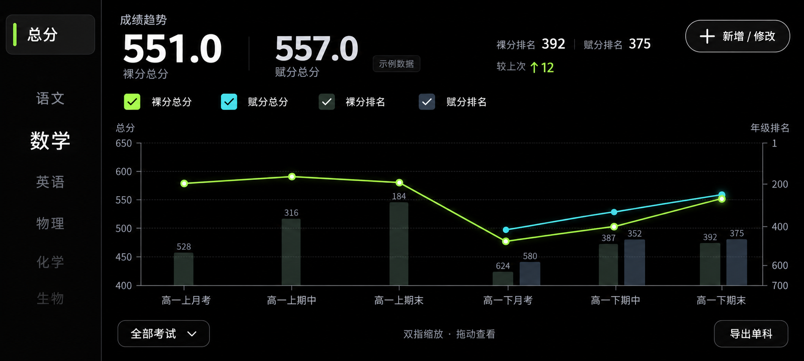

# grandeTrend：横屏安卓成绩趋势应用

更新日期：2026-10-04（Asia/Shanghai）

## 1. 文档状态与开发交接

本文记录最初讨论中确认的需求。首版已经实现；用户随后确认的 1.1 数据导入导出与更新保留需求见第 14 节，1.2 新增/修改页美化需求见第 15 节。技术选择与验证结果分别见 `docs/implementation.md` 和 `docs/verification.md`。

最初讨论要求在说“开始”之前只创建 spec；用户之后已明确授权搭建首版，并授权第 14 节更新。本文已确认的需求无须重新询问。

标注为“建议默认”或“待定”的内容并非用户已确认的要求。开发时可以据此提出实现方案，不应将这些内容冒充已确认需求。

## 2. 产品目标与范围

- 面向本人使用的安卓手机应用，主要在横屏下操作。
- 手动录入、修改历次考试成绩，查看总分、单科成绩和年级排名趋势。
- 支持选科，不把学科组合写死为物化生。
- 支持导出单科图像，可一次勾选多个科目，每科生成一张独立图片。
- 采用纯黑背景、简洁布局、荧光成绩折线和淡色排名柱。
- 第一版不要求账号、多人管理、云同步、成绩识别或表格导入。

## 3. 来源与视觉参考

| 文件 | 用途 |
| --- | --- |
| [界面预览 v1](docs/ui-preview-v1.png) | 已展示给用户的视觉草案。采用荧光绿／青色折线和淡灰绿／灰蓝排名柱，图中为示例数据。尚未完成最终视觉验收。 |

原始成绩资料与手绘草图属于私密参考，不纳入公开仓库。左侧导航的最终结构为“固定总分块＋学科滚轮”。需求以本文记录的用户讨论为准。

## 4. 学科、成绩与排名规则

### 4.1 选科与满分

- 可选择所需学科。基本学科池包括语文、数学、英语、物理、化学、生物、历史、政治、地理。
- 不强制特定选科组合；自定义新增学科不是已确认要求。
- 语文、数学、英语默认满分为 150；其他学科默认满分为 100。
- 每次考试可以调整各科满分，历史记录保留该次考试的满分，不能被后续默认值修改覆盖。
- 可建议使用固定学科偏好作为新考试默认值，但具体每次参考科目应能调整。

### 4.2 单科数据

- 每个科目记录裸分（原始分）和一个年级排名。
- 生物、化学、政治、地理支持手动填写赋分，赋分是选填项。
- 其他科目默认不提供赋分字段。
- 某些考试可能不公布赋分；未填写时保存为空，不保存为 0。
- 同一学科只有一个年级排名，裸分与赋分共用，不新增“单科裸分排名”和“单科赋分排名”两套字段。
- 缺失值不与实际 0 分混淆；未录入的成绩不画成 0 分点。
- 排名建议允许留空，以支持未公布排名的考试；这是建议默认。
- 分数应支持小数，不能仅使用整数。有效数值不得因显示取整而改变。

### 4.3 总分与总排名

- 总览区分裸分总成绩、赋分总成绩。
- 总排名分为“裸分总排名”和“赋分总排名”，手动录入。
- 没有赋分的考试，其赋分总排名为空；不能用裸分总排名替代。
- 总排名不能由各科排名相加、平均或通过分数猜测得出。
- 总成绩计算／录入方式尚未明确确认：建议按本次考试参与科目求和，并允许手动填写或覆盖官方公布的总成绩。
- 赋分总成绩的建议计算方式：非赋分学科使用裸分，赋分学科使用该科赋分；所需赋分未齐全时，自动计算结果为空。不能悄悄用裸分补齐缺失赋分。
- 自动总成绩规则属于建议默认，进入开发时需要明确采用方案，并保留“缺失不等于零”的原则。

## 5. 界面结构

### 5.1 横屏主界面

- 适配安卓横屏手机，而非以平板或桌面网页为主要尺寸。
- 左侧保持窄导航区，右侧为大面积数据展示和图表区。
- 主界面直接使用黑色底，不套入额外大卡片或设备外框。
- 支持不同横屏手机尺寸，保证左右轴、考试标签和右上角按钮不被裁切。

### 5.2 左侧：固定总分块与单科滚轮

- 左上角固定“总分”选项块，点击进入首页总览。
- 启动时默认进入总分视图。
- 总分块下方为纵向学科滚轮，仅显示已选择的学科。
- 滚轮中心行较大、清晰，上下相邻项目渐淡，上下边缘有淡出效果。
- 滚轮停稳后，以中心科目切换单科图表；点击可见科目也可作为辅助操作。
- 总分与单科必须是互斥的当前视图，不能同时出现两个同等强度的选中状态。
- 预览 v1 中“数学”中心行较亮，实际实现应注意总分模式下的滚轮样式，避免让用户误以为正在查看数学。

### 5.3 右上角：新增／修改成绩

- 提供清晰的“新增／修改”入口。
- 新增模式录入一次考试及其各科成绩、排名和总排名。
- 修改模式编辑已有考试；默认可指向当前图中选中的考试，并允许切换其他考试。
- 两种模式明确区分，编辑已有考试不能意外生成重复记录。
- 删除考试、撤销等行为并未在讨论中确定，不应当作必需功能增加复杂操作。

### 5.4 数据摘要和选择交互

- 图表上方用较大的数字展示当前考试的总成绩或单科成绩，搭配简洁排名信息。
- 点击图中数据点或柱子查看对应考试，摘要与当前考试同步。
- 日期、考试和时间范围等适合顺序选择的选项可采用滚轮。
- 指标显示选择采用独立开关／勾选，不使用只能单选的滚轮。
- 建议记住总览和每个单科各自的显示选择。

## 6. 首页总览组合图

### 6.1 图形与坐标轴

- 总成绩使用折线，总排名使用柱状图，二者共用考试时间轴。
- 左侧轴为分数；右侧轴为年级排名。
- 右侧排名轴反向：较小的名次在上方，较大的名次在下方。
- 排名柱从绘图区底部向对应名次延伸，名次越好，柱端越高；柱高不能直接取排名数值并将大名次呈现为更好。
- 同一次考试同时显示两种总排名时，使用并排的柱子，并对应同一个考试组。
- 两种总成绩使用可分辨的颜色，覆盖在淡色柱状图前方。
- 四个指标独立控制：裸分总成绩、赋分总成绩、裸分总排名、赋分总排名。
- 缺失成绩不绘制数据点，折线在缺失处断开；缺失排名不绘制柱子。
- 左右轴使用各自数据计算范围，不能为了视觉对齐而改变数值关系。

### 6.2 时间轴与范围选择

- 支持双指缩放。
- 缩小到最远时，一屏显示从第一次考试到当前的全部已录入记录，不把最远范围限制成最近几次考试。
- 放大后可以左右拖动，查看局部考试。
- 保留“全部考试”范围选择器。用户明确要求不用去掉。
- “全部考试”显示完整记录；选择器可用滚轮筛选学期或一段考试。
- 时间筛选与图表缩放是两个功能：筛选决定有哪些考试，缩放决定如何查看这些考试。
- 建议按考试日期排序，同日期考试保持稳定次序。
- 考试间距按真实日期还是等间距尚未确定；建议首次实现按考试等间距排列、显示考试名称，保留日期以便后续拓展。

## 7. 单科图表

- 裸分、赋分和年级排名均使用折线。
- 裸分与赋分共用左侧分数轴，年级排名使用右侧反向排名轴。
- 三个指标独立勾选；不支持赋分的学科不出现无意义的赋分开关。
- 支持与总览一致的考试范围选择、缩放和拖动。
- 当历次满分变化时保留实际分数，不偷偷按百分制换算。选中考试时可以查看该次满分；是否另加得分率不是本版已确认需求。
- 缺失值的处理与总览保持一致。

## 8. 视觉风格

- 纯黑背景，以白色／灰色文字和少量强调色组织内容。
- 成绩折线参考 OKX 余额视觉语言，采用荧光感：清晰细线、克制光晕，不使用模糊的大面积发光。
- 预览建议裸分使用荧光黄绿，赋分使用青色；具体色值可以随视觉反馈调整。
- 总排名柱尽量淡，采用低饱和、低透明度灰绿／灰蓝，不与成绩曲线争夺注意力。
- 柱子虽淡仍需可辨识，并通过图例和选中态明确指标。
- 网格线很淡，减少边框、阴影和装饰；数字、文字、图表是重点。
- 预览只是静态视觉参考；缩放、滚轮、编辑和导出必须在真实应用中实现，不能以静态图片充当应用界面。

## 9. 手动录入与修改

建议一次考试表单包含：

| 信息 | 规则 |
| --- | --- |
| 考试名称 | 例如月考、期中、期末，用于时间轴显示。 |
| 日期 | 支持滚轮选择；用于排序与范围筛选。 |
| 学期 | 建议支持，以便按学期筛选。 |
| 本次参考科目 | 从个人选科中选择，允许本次少考部分学科。 |
| 每科满分、裸分 | 满分有默认值，可修改；成绩支持小数。 |
| 每科赋分 | 仅适用于生物、化学、政治、地理，选填。 |
| 每科年级排名 | 单科只有一项排名，建议选填。 |
| 裸分总排名、赋分总排名 | 独立输入；没有赋分时后者留空。 |
| 总成绩 | 按第 4.3 节最终确定的录入／计算方案处理。 |
| 备注 | 建议选填，可记录联考范围、考试变化等信息。 |

校验建议：排名为正整数，成绩为非负数；空值与零值分别保存。成绩超过满分时提示核对，避免不经提示自动截断或改写。保存后图表和摘要刷新，修改历史成绩时一并更新相关总分。

## 10. 单科图像导出

- 通过导出入口选择一个或多个科目。
- 每科导出独立图片，不默认拼成一张多科大图。
- 使用该科当前选择的显示指标和考试时间范围，输出图例、坐标轴、考试名称和相应数值。
- 图中包含科目标题，移除导航、录入按钮和其他操作控件。
- 是否把当前放大的可见区域作为默认范围尚未单独确认；建议提供“当前可见范围／当前筛选的全部考试”选项，避免无意漏掉数据。
- 建议首版使用高分辨率 PNG、黑底，与界面一致；具体分辨率、白底打印模式未确认。
- 实际实现需能保存／分享图片，并适配所选 Android 版本的媒体保存方式。
- 总览图导出和 PDF 导出不是本版必需范围。

## 11. 数据保存与技术边界

- 技术栈尚未选定，本文不规定语言、UI 框架或最低 Android 版本。
- 最终目标为可安装的安卓应用，不能仅交付横屏网页或静态原型。
- 建议默认本机离线持久化，无须登录；重启应用后成绩和个人选科仍存在。
- 备份／恢复已提出为建议，但用户尚未明确确认，不应当作确认功能。
- 数据结构至少保留每次考试的科目、当次满分、裸分、可空赋分、单科排名和两种总排名。
- 不把示例图中的数据和 PDF 中的姓名作为真实用户初始数据。空数据时提供简洁的首次录入入口。
- 不在本次 spec 创建中安装依赖、搭建项目、选择架构或生成 APK。

## 12. 首版验收清单

- [ ] 安卓手机横屏启动后进入总分总览。
- [ ] 固定总分块、学科滚轮与右上角新增／修改入口符合布局要求。
- [ ] 可选择学科；赋分字段仅针对规定学科且可以为空。
- [ ] 新增与修改考试后，图表正确更新，历史满分不被后续修改覆盖。
- [ ] 单科只有一个排名；总览支持裸分总排名和赋分总排名。
- [ ] 总览成绩为折线、排名为淡色柱状，双轴正确，名次越好柱端越高。
- [ ] 单科三项折线可独立显示，左轴分数、右轴反向排名。
- [ ] 缺失赋分与排名不画成零，不用另一指标的数据替代。
- [ ] 时间轴可以缩放至显示全部记录，放大后可拖动；保留范围选择器。
- [ ] 支持小数分数与逐次变化的满分。
- [ ] 可选多个科目批量导出，每科生成一张清晰图片，范围和指标符合选择。
- [ ] 在目标横屏手机尺寸下，文字、曲线、柱子、滚轮和操作入口可读可用。
- [ ] 使用有缺失赋分、不同满分、早期无赋分排名和较多考试记录的数据验证核心行为。

## 13. 下一次对话的搭建入口

建议新对话直接发送：

> 开始搭建这个横屏安卓应用。先阅读项目中的 SPEC.md，并以 docs/ui-preview-v1.png 为视觉参考；按已确认需求实现，对标为建议默认的细节说明采用方案，完成可安装版本和核心功能验证。

## 14. 1.1 更新需求（2026-10-04，已确认）

用户在首版交付后明确要求增加数据导入导出，并在移动端更新时保留用户数据；此要求覆盖第 11 节中备份恢复尚未确认的状态。

- 提供完整的 JSON 数据备份导出和导入恢复，覆盖全部考试、历史满分、精确小数、空值、排名、备注、选科和显示设置。
- 使用系统文件选择界面，导入先校验与预览，默认合并、保留本机同 ID 记录；显式选择后才覆盖同 ID 考试或恢复设置，不删除其他本机考试。
- 导入整体事务写入，失败回滚；导入前自动保留最近一次本机备份，并可另行导出。
- 新版保持包名与原签名，递增应用版本号；数据库结构不变时直接沿用原库，改结构时必须添加保留数据的逐版本迁移。
- 交付前验证首版保存数据后实际覆盖安装新版，成绩、选科、显示偏好与原数据保持一致。
- CSV / Excel 通用成绩表导入与云同步仍不在本次更新范围内。

## 15. 1.2 界面更新（2026-10-04，已确认）

用户要求美化“增添修改页”，尽量少用 Android 默认界面，可以自行设计。

- 新增/修改界面延续现有纯黑、荧光绿与青色风格，使用应用自行设计的布局和控件。
- 优化横屏下考试信息、科目成绩、总分和排名的组织，减少重复标签与默认表单样式。
- 录入、日期选择、历史考试切换、超分确认均使用真实交互；保留成绩规则、精确小数和空值语义。
- 继续保持数据备份功能与覆盖更新的数据保留要求。
- 用户进一步反馈排版偏挤、可视信息过少，要求适当缩小栏目；压缩控件高度、间距与标题/摘要占用，增加同屏可见信息。

## 16. 1.3 交互与单次考试更新（2026-10-04，已确认）

用户要求左侧滚轮在滚动时同步刷新图表、增加删除考试、解决两处选科功能冲突，并用多边形查看单次考试得分。本节覆盖前文中滚轮停稳才切换及删除考试未纳入范围的旧约定。

- 左侧科目滚轮在手指拖动、惯性滚动和吸附过程中，中心科目与标题、摘要、图表、指标同步切换；启动仍默认总分，不因首次布局自动切科。
- 主页面“常用科目”决定新增考试的默认科目；添加页“本场科目”只记录本次实际科目。滚轮及导出候选科目包含常用科目与全部历史考试涉及科目的并集，避免临时加科或修改常用科目后成绩无法查看。修改考试沿用该记录原科目和当次满分。
- “单次考试”打开当前选中考试，支持前后切换与进入修改；采用自定义黑底界面，展示裸分/赋分雷达多边形与原始分数、满分、得分率、官方总分及总排名。
- 雷达图按各科本场满分归一化为得分率，不改变原始成绩；赋分视图仅在赋分学科使用其赋分，其余科目使用裸分，并明确说明。零分为中心数据点，未公布处断开且不填充完整多边形；少于三科采用得分率条形图。已确认的超满分值扩展坐标上限，不截断。
- 单次考试页与修改页均提供删除入口，确认中显示考试名称、日期和影响；取消不写入。只删除目标考试及其成绩，其他考试、常用科目和显示偏好保留。删除后刷新图表与摘要，修复自定义范围的被删端点；最后一场删除后显示首次录入状态，并恢复“全部考试”，避免后续录入被旧筛选隐藏。
- 保持包名、签名、数据库版本 1 与备份格式 1，递增安装版本为 1.3.0 / versionCode 4；验证实际覆盖安装的数据保留。
